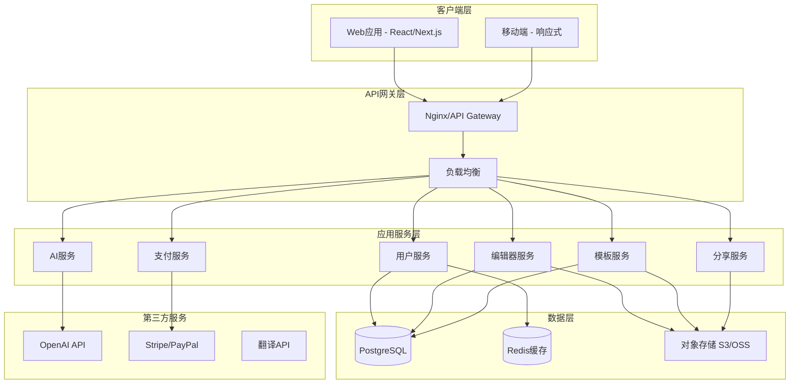
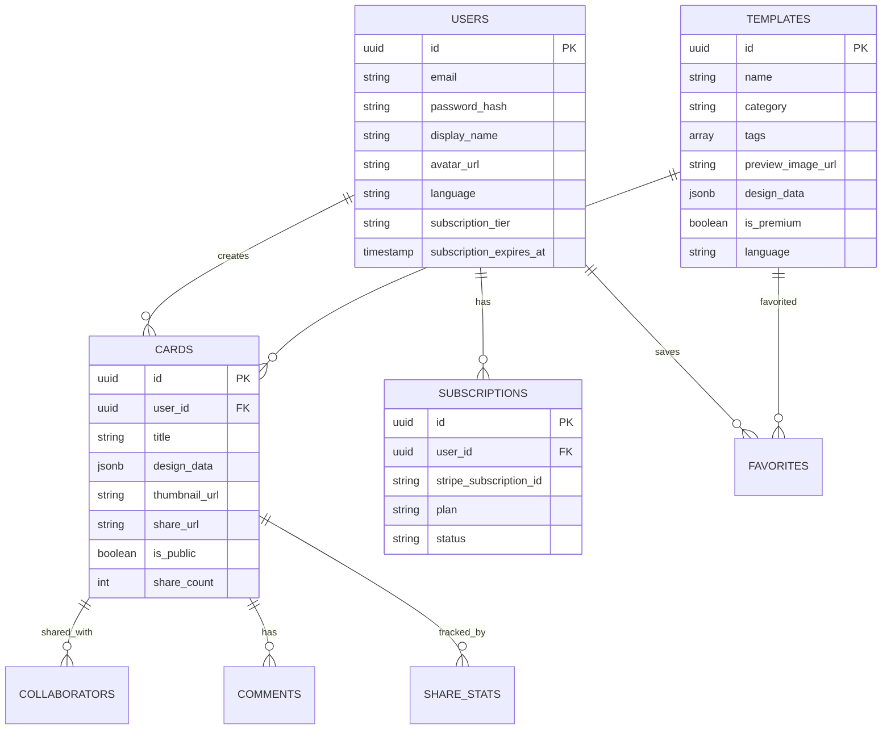
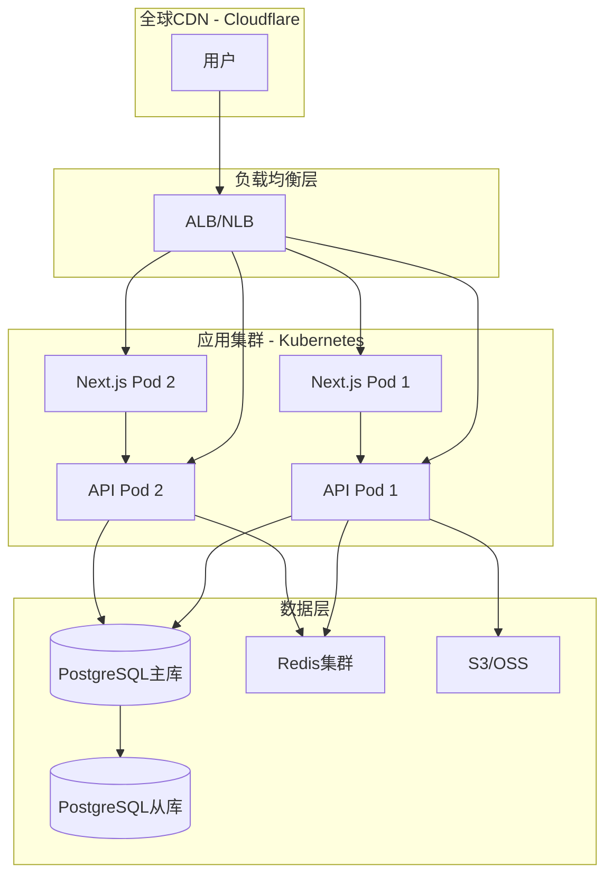
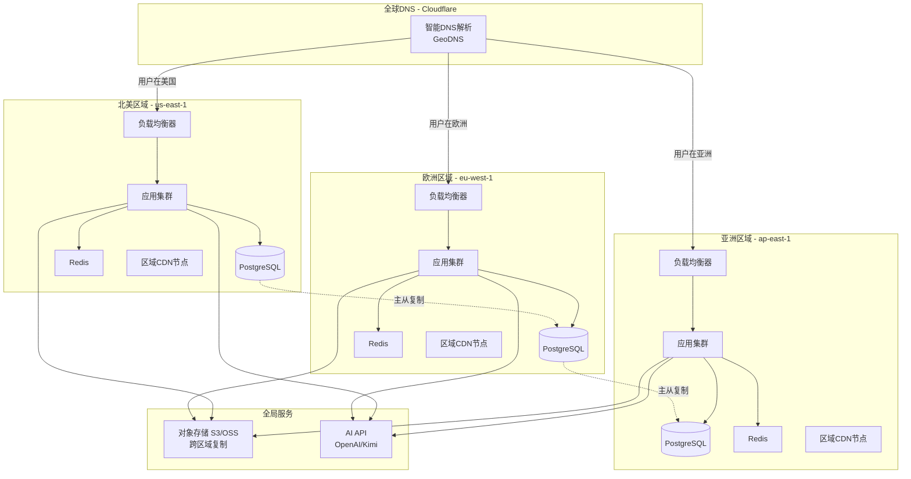

# 电子贺卡出海项目 - 开发计划文档

> 基于AI技术的多语言电子贺卡制作平台 - 技术实施方案  
> 最后更新：2026-01-29

---

## 📋 项目概述

### 开发目标
构建一个功能完整、技术先进、用户体验优秀的电子贺卡SaaS平台，支持全球化部署和多语言服务。

### 项目范围
- **MVP阶段**：核心功能实现（编辑器、模板、用户系统、支付）
- **第一期**：AI功能集成、社交分享、协作功能
- **第二期**：高级功能、性能优化、全球化部署

### 关键里程碑
| 阶段 | 时间估算 | 交付内容 |
|------|----------|----------|
| 技术调研与架构设计 | 2周 | 技术选型文档、架构设计方案 |
| MVP开发 | 8周 | 基础编辑器、模板库、用户系统 |
| AI功能集成 | 3周 | AI文案生成、设计建议功能 |
| 支付与会员系统 | 2周 | 订阅付费、多支付方式集成 |
| 测试与优化 | 2周 | 功能测试、性能优化、bug修复 |
| Beta发布 | 1周 | 小规模用户测试 |
| 正式上线 | - | 全球化部署、市场推广 |

**总计**：约18周（4.5个月）完成MVP到Beta版本

---

## 🏗️ 技术架构

### 整体架构



### 技术栈选型

#### 前端技术栈
```diff
+ 核心框架：Next.js 14+ (React 18+)
  - 优势：SSR支持、优秀的SEO、API路由、国际化
  - 替代方案：Nuxt.js (Vue生态)

+ 状态管理：Zustand / Redux Toolkit
  - 轻量灵活，适合中大型应用

+ UI组件库：Tailwind CSS + Headless UI
  - 高度定制化，符合现代设计需求
  - 备选：Chakra UI、Ant Design

+ 图形编辑：Fabric.js / Konva.js
  - Canvas操作库，支持拖拽、缩放、旋转
  - 用于实现贺卡编辑器核心功能

+ 动画库：Framer Motion
  - 流畅的交互动画和页面过渡

+ 表单管理：React Hook Form + Zod
  - 高性能表单验证

+ HTTP客户端：Axios / TanStack Query
  - 数据获取、缓存、同步
```

#### 后端技术栈
```diff
+ 服务端框架：Node.js + Express / Nest.js
  - 优势：JavaScript全栈、生态丰富
  - 替代方案：Python + FastAPI

+ 数据库：PostgreSQL 15+
  - 用户数据、贺卡元数据、订单信息
  - 支持JSON字段存储贺卡设计数据

+ 缓存：Redis 7+
  - 会话管理、热门模板缓存、API限流

+ 对象存储：AWS S3 / 阿里云OSS
  - 图片、模板文件、用户上传资源

+ 消息队列：Redis Queue / RabbitMQ
  - 异步任务（AI生成、邮件发送、分享通知）

+ 认证：NextAuth.js / JWT
  - OAuth社交登录、邮箱登录

+ API文档：OpenAPI / Swagger
  - 自动生成API文档
```

#### AI集成
```diff
+ 文案生成：OpenAI GPT-4 / Kimi
  - 多语言祝福文案生成
  - 设计建议和排版推荐

+ 图像处理：Sharp / ImageMagick
  - 图片压缩、格式转换、水印添加

+ 翻译服务：Google Translate API / DeepL
  - 跨语言贺卡翻译
```

#### DevOps与部署
```diff
+ 容器化：Docker + Docker Compose
+ 编排：Kubernetes (生产环境)
+ CI/CD：GitHub Actions / GitLab CI
+ 监控：Prometheus + Grafana
+ 日志：ELK Stack (Elasticsearch, Logstash, Kibana)
+ CDN：Cloudflare / AWS CloudFront
+ 域名DNS：Cloudflare DNS
```

---

## 🎯 功能模块开发计划

### 1. 用户系统模块

#### 功能点
- [ ] 用户注册与登录（邮箱、社交登录）
- [ ] 用户个人中心（头像、昵称、语言偏好）
- [ ] JWT认证与权限管理
- [ ] 密码找回与重置
- [ ] 多语言界面切换

#### 技术实现
- **认证**：NextAuth.js + JWT
- **社交登录**：Google、Facebook OAuth
- **数据模型**：
  ```sql
  CREATE TABLE users (
    id UUID PRIMARY KEY DEFAULT gen_random_uuid(),
    email VARCHAR(255) UNIQUE NOT NULL,
    password_hash VARCHAR(255),
    display_name VARCHAR(100),
    avatar_url TEXT,
    language VARCHAR(10) DEFAULT 'en',
    subscription_tier VARCHAR(20) DEFAULT 'free',
    subscription_expires_at TIMESTAMP,
    created_at TIMESTAMP DEFAULT NOW(),
    updated_at TIMESTAMP DEFAULT NOW()
  );
  ```

#### 时间估算：1.5周

---

### 2. 模板库模块

#### 功能点
- [ ] 模板分类浏览（生日、节日、感谢等）
- [ ] 模板搜索与筛选
- [ ] 模板预览与收藏
- [ ] 会员专属模板
- [ ] 管理后台：关键数据总览、模板上传与管理、页面CMS管理、用户管理、用户内容审核、订单管理、套餐管理、支付管理、AI模型管理、SEO管理

#### 技术实现
- **存储**：模板JSON数据存PostgreSQL，预览图存S3
- **搜索**：PostgreSQL全文搜索 或 Elasticsearch
- **数据模型**：
  ```sql
  CREATE TABLE templates (
    id UUID PRIMARY KEY DEFAULT gen_random_uuid(),
    name VARCHAR(255) NOT NULL,
    category VARCHAR(50),
    tags TEXT[], -- 标签数组
    preview_image_url TEXT,
    design_data JSONB, -- 贺卡设计JSON
    is_premium BOOLEAN DEFAULT false,
    language VARCHAR(10) DEFAULT 'en',
    downloads_count INT DEFAULT 0,
    created_at TIMESTAMP DEFAULT NOW()
  );
  ```

#### 时间估算：2周

---

### 3. 在线编辑器模块

#### 功能点
- [ ] Canvas画布渲染
- [ ] 文字添加与编辑（字体、大小、颜色）
- [ ] 图片上传与调整
- [ ] 背景设置（纯色、渐变、图片）
- [ ] 元素拖拽、缩放、旋转
- [ ] 图层管理（上移、下移、置顶）
- [ ] 撤销/重做功能
- [ ] 自动保存与版本历史
- [ ] 实时预览

#### 技术实现
- **Canvas库**：Fabric.js
  - 提供丰富的图形操作API
  - 支持JSON序列化贺卡设计
- **自动保存**：防抖函数 + API请求
- **版本历史**：存储设计快照到数据库
- **数据模型**：
  ```sql
  CREATE TABLE cards (
    id UUID PRIMARY KEY DEFAULT gen_random_uuid(),
    user_id UUID REFERENCES users(id),
    title VARCHAR(255),
    design_data JSONB, -- Fabric.js JSON
    thumbnail_url TEXT,
    share_url VARCHAR(255) UNIQUE,
    share_count INT DEFAULT 0,
    is_public BOOLEAN DEFAULT false,
    created_at TIMESTAMP DEFAULT NOW(),
    updated_at TIMESTAMP DEFAULT NOW()
  );
  ```

#### 时间估算：3周

---

### 4. AI智能助手模块

#### 功能点
- [ ] AI文案生成（根据场景和情感）
- [ ] 设计建议（排版、配色）
- [ ] 风格推荐
- [ ] 多语言文案翻译

#### 技术实现
- **AI Provider**：OpenAI GPT-4 API
- **Prompt工程**：
  ```javascript
  const generateGreetingText = async (occasion, emotion, language) => {
    const prompt = `
      Generate a heartfelt ${occasion} greeting card message in ${language}.
      Emotional tone: ${emotion}.
      Keep it concise (2-3 sentences) and warm.
    `;
    
    const response = await openai.chat.completions.create({
      model: "gpt-4",
      messages: [{ role: "user", content: prompt }],
      max_tokens: 150,
      temperature: 0.8,
    });
    
    return response.choices[0].message.content;
  };
  ```
- **费用控制**：
  - 免费用户：每月限制3次AI生成
  - 付费用户：无限制使用
  - 使用Redis记录用户AI调用次数

#### 时间估算：2周

---

### 5. 实时协作模块

#### 功能点
- [ ] 邀请协作者（通过链接或邮箱）
- [ ] 实时编辑同步
- [ ] 用户指针显示
- [ ] 评论与反馈
- [ ] 权限管理（查看/编辑）

#### 技术实现
- **WebSocket**：Socket.io
- **数据同步**：OT (Operational Transformation) 或 CRDT
- **架构**：
  ```mermaid
  graph LR
      A[用户A] -->|WebSocket| C[协作服务器]
      B[用户B] -->|WebSocket| C
      C -->|广播变更| A
      C -->|广播变更| B
      C -->|持久化| D[(数据库)]
  ```

#### 时间估算：2.5周

---

### 6. 社交分享模块

#### 功能点
- [ ] 生成唯一分享链接
- [ ] 社交媒体一键分享（FB、Twitter、Instagram、WhatsApp、小红书、微信）
- [ ] 嵌入代码生成
- [ ] 下载贺卡（PNG、JPG、PDF）
- [ ] 分享统计（浏览量、分享次数）

#### 技术实现
- **短链生成**：nanoid库生成唯一ID
- **图片渲染**：
  - 前端：html2canvas 或 Fabric.toDataURL()
  - 后端：Puppeteer截图服务（生成高清预览图）
- **PDF生成**：jsPDF
- **分享按钮**：react-share库

#### 时间估算：1.5周

---

### 7. 支付与会员系统

#### 功能点
- [ ] 订阅计划展示
- [ ] PayPal支付集成
- [ ] 支付宝国际支付
- [ ] Stripe支付集成
- [ ] 微信支付（国内市场）
- [ ] 订阅管理（升级、降级、取消）
- [ ] 发票生成
- [ ] Webhook处理（支付成功/失败）

#### 技术实现
- **支付网关**：Stripe Checkout + Webhooks
- **订阅逻辑**：
  ```javascript
  // Stripe订阅创建
  const subscription = await stripe.subscriptions.create({
    customer: customerId,
    items: [{ price: priceId }], // monthly/quarterly/yearly
    payment_behavior: 'default_incomplete',
    expand: ['latest_invoice.payment_intent'],
  });
  ```
- **Webhook安全**：验证Stripe签名
- **数据模型**：
  ```sql
  CREATE TABLE subscriptions (
    id UUID PRIMARY KEY DEFAULT gen_random_uuid(),
    user_id UUID REFERENCES users(id),
    stripe_subscription_id VARCHAR(255) UNIQUE,
    plan VARCHAR(20), -- 'monthly', 'quarterly', 'yearly'
    status VARCHAR(20), -- 'active', 'cancelled', 'past_due'
    current_period_start TIMESTAMP,
    current_period_end TIMESTAMP,
    created_at TIMESTAMP DEFAULT NOW()
  );
  ```

#### 时间估算：2周

---

### 8. 多语言国际化

#### 功能点
- [ ] 界面多语言切换（i18n）
- [ ] 模板内容本地化
- [ ] 自动检测用户语言
- [ ] 节日库本地化（各国节日）

#### 技术实现
- **i18n库**：next-i18next
- **语言文件结构**：
  ```
  /locales
    /en
      common.json
      editor.json
      pricing.json
    /zh
      common.json
      editor.json
      pricing.json
    /fr, /de, /es ...
  ```
- **动态加载**：按需加载语言包，减少初始加载体积

#### 时间估算：1.5周

---

### 9. 管理后台

#### 功能点
- [ ] 用户管理（查看、封禁）
- [ ] 模板管理（上传、编辑、删除）
- [ ] 订单管理
- [ ] 数据统计（用户增长、收入、活跃度）
- [ ] 内容审核
- [ ] SEO管理
- [ ] AI模型管理

#### 技术实现
- **后台框架**：React Admin / Retool
- **权限控制**：RBAC（基于角色的访问控制）
- **数据可视化**：Recharts / Chart.js

#### 时间估算：2周

---

## 📊 数据库设计

### 核心表结构总览



### 索引策略
```sql
-- 用户表
CREATE INDEX idx_users_email ON users(email);
CREATE INDEX idx_users_subscription_tier ON users(subscription_tier);

-- 模板表
CREATE INDEX idx_templates_category ON templates(category);
CREATE INDEX idx_templates_language ON templates(language);
CREATE INDEX idx_templates_tags ON templates USING GIN(tags);

-- 贺卡表
CREATE INDEX idx_cards_user_id ON cards(user_id);
CREATE INDEX idx_cards_share_url ON cards(share_url);
CREATE INDEX idx_cards_created_at ON cards(created_at DESC);
```

---

## 🔐 安全与合规

### 安全措施
- [ ] **HTTPS强制**：所有通信加密
- [ ] **SQL注入防护**：使用参数化查询/ORM
- [ ] **XSS防护**：内容转义、CSP策略
- [ ] **CSRF防护**：Token验证
- [ ] **API限流**：Redis + rate-limiter
- [ ] **文件上传安全**：类型检查、大小限制、病毒扫描
- [ ] **密码安全**：bcrypt哈希、salt处理

### 数据合规
- [ ] **GDPR合规**（欧盟）：
  - 用户数据导出功能
  - 账户删除与数据清理
  - Cookie同意横幅
  - 隐私政策页面
  
- [ ] **CCPA合规**（加州）：
  - 数据收集透明化
  - 选择退出选项

- [ ] **中国网络安全法**：
  - ICP备案
  - 数据本地化存储

---

## 🚀 部署方案

### 环境划分
- **开发环境**：本地Docker Compose
- **测试环境**：AWS/阿里云 EC2 + RDS
- **生产环境**：Kubernetes集群 + 负载均衡

### 生产架构


### CI/CD流程
```yaml
# .github/workflows/deploy.yml
name: Deploy to Production

on:
  push:
    branches: [main]

jobs:
  test:
    runs-on: ubuntu-latest
    steps:
      - uses: actions/checkout@v3
      - name: Run tests
        run: npm test
      
  build:
    needs: test
    runs-on: ubuntu-latest
    steps:
      - name: Build Docker image
        run: docker build -t greeting-card:${{ github.sha }} .
      - name: Push to registry
        run: docker push greeting-card:${{ github.sha }}
  
  deploy:
    needs: build
    runs-on: ubuntu-latest
    steps:
      - name: Deploy to Kubernetes
        run: kubectl set image deployment/greeting-card app=greeting-card:${{ github.sha }}
```

---

## 🌐 GEO技术实现方案

### GEO架构设计

GEO优化是支撑全球化扩展的关键技术底座，涉及多区域部署、智能流量调度、本地化数据服务等核心能力。

#### 全球多区域部署架构



---

### 🗺️ 地理位置检测与路由

#### 1. IP地理位置检测
```javascript
// 使用Cloudflare Headers获取地理位置
export async function detectUserLocation(request) {
  const country = request.headers.get('CF-IPCountry') || 'US';
  const city = request.headers.get('CF-IPCity');
  const timezone = request.headers.get('CF-Timezone');
  const latitude = request.headers.get('CF-IPLatitude');
  const longitude = request.headers.get('CF-IPLongitude');
  
  return {
    country,
    city,
    timezone,
    coordinates: { latitude, longitude }
  };
}

// 备选方案：MaxMind GeoIP2
import maxmind from 'maxmind';

export async function getGeoFromIP(ip) {
  const lookup = await maxmind.open('/path/to/GeoLite2-City.mmdb');
  const geoData = lookup.get(ip);
  
  return {
    country: geoData.country.iso_code,
    city: geoData.city.names.en,
    timezone: geoData.location.time_zone,
    coordinates: {
      latitude: geoData.location.latitude,
      longitude: geoData.location.longitude
    }
  };
}
```

#### 2. 智能语言检测
```javascript
// 按优先级检测用户语言
export function detectUserLanguage(request, userProfile) {
  // 1. 用户设置的语言（最高优先级）
  if (userProfile?.language) {
    return userProfile.language;
  }
  
  // 2. Cookie中保存的语言偏好
  const cookieLang = request.cookies.get('preferred_language');
  if (cookieLang) {
    return cookieLang;
  }
  
  // 3. 根据地理位置推断
  const country = request.headers.get('CF-IPCountry');
  const countryToLanguage = {
    'US': 'en',
    'GB': 'en',
    'CA': 'en',
    'FR': 'fr',
    'DE': 'de',
    'ES': 'es',
    'CN': 'zh',
    'JP': 'ja',
    'KR': 'ko'
  };
  
  if (countryToLanguage[country]) {
    return countryToLanguage[country];
  }
  
  // 4. Accept-Language header
  const acceptLang = request.headers.get('Accept-Language');
  if (acceptLang) {
    const primaryLang = acceptLang.split(',')[0].split('-')[0];
    return primaryLang;
  }
  
  // 5. 默认英语
  return 'en';
}
```

#### 3. Next.js中间件实现
```javascript
// middleware.ts
import { NextResponse } from 'next/server';
import type { NextRequest } from 'next/server';

export function middleware(request: NextRequest) {
  const country = request.geo?.country || 'US';
  const pathname = request.nextUrl.pathname;
  
  // 跳过API路由和静态资源
  if (pathname.startsWith('/api') || pathname.startsWith('/_next')) {
    return NextResponse.next();
  }
  
  // 语言路径映射
  const localePathMapping = {
    'US': '/en-us',
    'GB': '/en-gb',
    'FR': '/fr-fr',
    'DE': '/de-de',
    'ES': '/es-es',
    'CN': '/zh-cn',
  };
  
  const targetLocale = localePathMapping[country] || '/en-us';
  
  // 如果用户访问根路径，重定向到对应语言版本
  if (pathname === '/') {
    return NextResponse.redirect(new URL(targetLocale, request.url));
  }
  
  // 添加地理位置header供应用使用
  const response = NextResponse.next();
  response.headers.set('X-User-Country', country);
  response.headers.set('X-User-Timezone', request.geo?.timezone || 'UTC');
  
  return response;
}

export const config = {
  matcher: ['/((?!api|_next/static|_next/image|favicon.ico).*)'],
};
```

---

### 🚀 CDN与内容分发优化

#### 1. Cloudflare CDN配置
```javascript
// cloudflare-config.js
module.exports = {
  // 缓存策略
  cacheRules: [
    {
      // 静态资源长期缓存
      pattern: '/static/*',
      cacheTTL: 31536000, // 1年
      browserTTL: 31536000
    },
    {
      // 模板预览图
      pattern: '/templates/preview/*',
      cacheTTL: 86400, // 1天
      browserTTL: 3600, // 1小时
    },
    {
      // HTML页面短期缓存
      pattern: '/*.html',
      cacheTTL: 3600,
      browserTTL: 600
    }
  ],
  
  // 地理位置路由
  geoRouting: {
    'US': 'us-east-1.greetingcard.com',
    'EU': 'eu-west-1.greetingcard.com',
    'AS': 'ap-east-1.greetingcard.com',
  },
  
  // 智能压缩
  compression: {
    brotli: true,
    gzip: true,
    minSize: 1024 // 大于1KB才压缩
  }
};
```

#### 2. S3跨区域复制
```yaml
# AWS S3 Cross-Region Replication
# s3-replication-config.yaml
ReplicationConfiguration:
  Role: arn:aws:iam::ACCOUNT-ID:role/s3-replication-role
  Rules:
    - Id: ReplicateToEU
      Status: Enabled
      Priority: 1
      Filter:
        Prefix: templates/
      Destination:
        Bucket: arn:aws:s3:::greetingcard-eu-west-1
        ReplicationTime:
          Status: Enabled
          Time:
            Minutes: 15
    - Id: ReplicateToAsia
      Status: Enabled
      Priority: 2
      Filter:
        Prefix: templates/
      Destination:
        Bucket: arn:aws:s3:::greetingcard-ap-east-1
        ReplicationTime:
          Status: Enabled
          Time:
            Minutes: 15
```

#### 3. 图片CDN优化
```javascript
// 使用Cloudflare Image Resizing
export function getOptimizedImageURL(originalUrl, options = {}) {
  const {
    width = 800,
    quality = 85,
    format = 'auto', // 自动选择webp或原格式
    country = 'US'
  } = options;
  
  // Cloudflare Image Resizing
  const cdnUrl = `https://greetingcard.com/cdn-cgi/image/width=${width},quality=${quality},format=${format}/${originalUrl}`;
  
  return cdnUrl;
}

// 使用示例
const templatePreview = getOptimizedImageURL(
  'templates/birthday-001.jpg',
  { width: 600, quality: 80, country: userCountry }
);
```

---

### 💾 数据库地理分布策略

#### 1. 读写分离 + 地理就近访问
```javascript
// database-routing.js
import { Pool } from 'pg';

const dbPools = {
  'us-east-1': {
    master: new Pool({ host: 'us-db-master.internal', ... }),
    replica: new Pool({ host: 'us-db-replica.internal', ... })
  },
  'eu-west-1': {
    master: new Pool({ host: 'eu-db-master.internal', ... }),
    replica: new Pool({ host: 'eu-db-replica.internal', ... })
  },
  'ap-east-1': {
    master: new Pool({ host: 'ap-db-master.internal', ... }),
    replica: new Pool({ host: 'ap-db-replica.internal', ... })
  }
};

export function getDBConnection(region, operation = 'read') {
  const pool = dbPools[region];
  
  // 写操作用主库，读操作用从库
  return operation === 'write' ? pool.master : pool.replica;
}

// 使用示例
export async function getUserCards(userId, userRegion) {
  const db = getDBConnection(userRegion, 'read');
  const result = await db.query(
    'SELECT * FROM cards WHERE user_id = $1',
    [userId]
  );
  return result.rows;
}
```

#### 2. 数据分片策略（可选 - 大规模时）
```sql
-- 按地理位置分片用户数据
CREATE TABLE users_us PARTITION OF users
  FOR VALUES IN ('US', 'CA', 'MX');

CREATE TABLE users_eu PARTITION OF users  
  FOR VALUES IN ('GB', 'FR', 'DE', 'ES', 'IT');

CREATE TABLE users_asia PARTITION OF users
  FOR VALUES IN ('CN', 'JP', 'KR', 'SG');
```

---

### 🎯 基于地理位置的功能实现

#### 1. 模板推荐算法
```javascript
// template-recommendation.js
export async function getRecommendedTemplates(userCountry, occasion) {
  // 获取当地即将到来的节日
  const upcomingHolidays = getUpcomingHolidays(userCountry);
  
  // 查询本地化模板
  const templates = await db.query(`
    SELECT * FROM templates
    WHERE (
      -- 完全匹配用户国家的模板
      country = $1
      OR
      -- 同语言但不同国家的模板
      language = (SELECT language FROM countries WHERE code = $1)
      OR
      -- 通用模板
      is_universal = true
    )
    AND (
      -- 节日相关
      category = ANY($2::text[])
      OR
      -- 场景相关
      occasion = $3
    )
    ORDER BY
      -- 优先级：完全匹配 > 语言匹配 > 通用
      CASE
        WHEN country = $1 THEN 1
        WHEN language = (SELECT language FROM countries WHERE code = $1) THEN 2
        ELSE 3
      END,
      popularity DESC
    LIMIT 20
  `, [userCountry, upcomingHolidays, occasion]);
  
  return templates.rows;
}

// 节日日历（简化版）
function getUpcomingHolidays(country) {
  const now = new Date();
  const twoWeeksLater = new Date(now.getTime() + 14 * 24 * 60 * 60 * 1000);
  
  const holidayCalendar = {
    'US': [
      { name: 'Thanksgiving', date: '2026-11-26', categories: ['holiday', 'gratitude'] },
      { name: 'Christmas', date: '2026-12-25', categories: ['holiday', 'christmas'] },
    ],
    'CN': [
      { name: 'Spring Festival', date: '2026-02-17', categories: ['holiday', 'new-year'] },
      { name: 'Mid-Autumn', date: '2026-09-25', categories: ['holiday', 'moon-festival'] },
    ],
    // 更多国家...
  };
  
  return holidayCalendar[country]?.filter(h => {
    const holidayDate = new Date(h.date);
    return holidayDate >= now && holidayDate <= twoWeeksLater;
  }).flatMap(h => h.categories) || [];
}
```

#### 2. 支付方式动态展示
```javascript
// payment-methods.js
export function getAvailablePaymentMethods(country) {
  const paymentConfig = {
    'US': [
      { id: 'paypal', name: 'PayPal', icon: '/icons/paypal.svg', priority: 1 },
      { id: 'stripe', name: 'Credit Card', icon: '/icons/card.svg', priority: 2 },
      { id: 'applepay', name: 'Apple Pay', icon: '/icons/apple.svg', priority: 3 },
    ],
    'CN': [
      { id: 'alipay', name: '支付宝', icon: '/icons/alipay.svg', priority: 1 },
      { id: 'wechatpay', name: '微信支付', icon: '/icons/wechat.svg', priority: 2 },
      { id: 'unionpay', name: '银联', icon: '/icons/unionpay.svg', priority: 3 },
    ],
    'DE': [
      { id: 'sepa', name: 'SEPA Direct Debit', icon: '/icons/sepa.svg', priority: 1 },
      { id: 'paypal', name: 'PayPal', icon: '/icons/paypal.svg', priority: 2 },
      { id: 'klarna', name: 'Klarna', icon: '/icons/klarna.svg', priority: 3 },
    ],
    // 默认选项
    'DEFAULT': [
      { id: 'paypal', name: 'PayPal', icon: '/icons/paypal.svg', priority: 1 },
      { id: 'stripe', name: 'Credit Card', icon: '/icons/card.svg', priority: 2 },
    ]
  };
  
  return paymentConfig[country] || paymentConfig['DEFAULT'];
}
```

#### 3. 货币本地化
```javascript
// currency-localization.js
const currencyByCountry = {
  'US': { code: 'USD', symbol: '$', rate: 1.0 },
  'GB': { code: 'GBP', symbol: '£', rate: 0.82 },
  'EU': { code: 'EUR', symbol: '€', rate: 0.92 },
  'CN': { code: 'CNY', symbol: '¥', rate: 7.2 },
  'JP': { code: 'JPY', symbol: '¥', rate: 148.5 },
};

export function formatPrice(priceUSD, country) {
  const currency = currencyByCountry[country] || currencyByCountry['US'];
  const localPrice = (priceUSD * currency.rate).toFixed(2);
  
  return `${currency.symbol}${localPrice}`;
}
```

---

### ⚡ 性能优化

#### 1. Edge Computing（边缘计算）
```javascript
// 使用Cloudflare Workers进行边缘计算
addEventListener('fetch', event => {
  event.respondWith(handleRequest(event.request));
});

async function handleRequest(request) {
  const url = new URL(request.url);
  const country = request.headers.get('CF-IPCountry') || 'US';
  
  // 在边缘节点直接返回静态模板列表（缓存）
  if (url.pathname === '/api/templates/popular') {
    const cacheKey = `popular-templates:${country}`;
    const cached = await EDGE_CACHE.get(cacheKey);
    
    if (cached) {
      return new Response(cached, {
        headers: { 'Content-Type': 'application/json' }
      });
    }
    
    // 缓存未命中，从源站获取
    const response = await fetch(request);
    const data = await response.text();
    
    // 缓存1小时
    await EDGE_CACHE.put(cacheKey, data, { expirationTtl: 3600 });
    
    return new Response(data, {
      headers: { 'Content-Type': 'application/json' }
    });
  }
  
  return fetch(request);
}
```

---

### 📊 GEO性能监控

#### 1. 按地区监控指标
```javascript
// geo-monitoring.js
export function trackGeoPerformance(req, res, next) {
  const startTime = Date.now();
  const country = req.headers['cf-ipcountry'] || 'UNKNOWN';
  const region = getRegionFromCountry(country);
  
  res.on('finish', () => {
    const duration = Date.now() - startTime;
    
    // 记录地理性能指标
    logger.info('geo_performance', {
      country,
      region,
      endpoint: req.path,
      duration,
      status: res.statusCode
    });
    
    // 发送到监控系统（Prometheus）
    metrics.histogram('api_request_duration_ms', duration, {
      country,
      region,
      endpoint: req.path
    });
  });
  
  next();
}
```

---

### 🚢 GEO部署清单

#### MVP阶段（单区域）
- [x] Cloudflare CDN配置
- [x] 地理位置检测中间件
- [x] 基础多语言支持

#### 第一阶段（3区域）
- [ ] 北美（us-east-1）主区域部署
- [ ] 欧洲（eu-west-1）区域部署
- [ ] 亚洲（ap-east-1）区域部署
- [ ] 跨区域数据同步
- [ ] GeoDNS智能路由

#### 第二阶段（优化）
- [ ] Edge Computing边缘计算
- [ ] 数据库读写分离
- [ ] 静态资源区域复制
- [ ] 性能监控分区dashboard

---

### 💰 GEO成本估算

| 服务 | MVP（单区域） | 3区域部署 | 月成本 |
|------|-------------|----------|--------|
| Cloudflare CDN | Pro Plan | Business Plan | $200 |
| AWS/阿里云服务器 | 1个区域 | 3个区域 | $800 |
| 数据库 | 单实例 | 3个区域主从 | $600 |
| 对象存储+CDN | 单区域 | 跨区域复制 | $300 |
| **总计** | **$500/月** | **$1,900/月** | **-** |

**ROI分析**：
- 通过GEO优化，预计可提升20-30%的转化率（加载速度提升）
- 本地化内容推荐可提升15-25%的用户留存
- 投入产出比：约6个月回本

---

## 🧪 测试策略

### 测试金字塔
1. **单元测试**（60%覆盖率目标）
   - Jest + React Testing Library
   - 组件逻辑、工具函数
   
2. **集成测试**（30%）
   - API端到端测试
   - Supertest测试API路由
   
3. **E2E测试**（10%）
   - Playwright / Cypress
   - 关键用户流程（注册、创建贺卡、支付）

### 性能测试
- **负载测试**：k6 / Artillery
- **目标指标**：
  - 首屏加载 < 2秒
  - API响应 < 200ms (p95)
  - 支持1000并发用户

---

## 📈 监控与运维

### 监控指标
- **业务指标**：
  - 注册用户数、活跃用户数
  - 贺卡创建数、分享数
  - 订阅转化率、MRR（月度经常性收入）
  
- **技术指标**：
  - 服务器CPU/内存使用率
  - API错误率、响应时间
  - 数据库查询性能
  - CDN缓存命中率

### 日志管理
- **结构化日志**：JSON格式
- **日志级别**：ERROR, WARN, INFO, DEBUG
- **日志聚合**：ELK Stack或云日志服务

### 告警机制
- **错误告警**：错误率 > 1%
- **性能告警**：API响应时间 > 500ms (p95)
- **业务告警**：支付失败率 > 5%
- **通知渠道**：Slack、邮件、PagerDuty

---

## 🔄 迭代计划

### MVP版本（v1.0）- 核心功能
- ✅ 用户注册与登录
- ✅ 模板库浏览
- ✅ 在线编辑器
- ✅ 基础分享功能
- ✅ 付费订阅

### v1.1 - AI增强
- 🔄 AI文案生成
- 🔄 AI设计建议
- 🔄 智能排版

### v1.2 - 协作与社交
- 📅 实时协作编辑
- 📅 评论功能
- 📅 社交媒体深度集成

### v1.3 - 移动端优化
- 📅 响应式优化
- 📅 触摸手势支持
- 📅 PWA支持

---

## 💡 技术风险与应对

| 风险 | 影响 | 概率 | 应对措施 |
|------|------|------|----------|
| AI API成本过高 | 高 | 中 | 限流策略、缓存常见文案、考虑自托管模型 |
| Canvas编辑器性能问题 | 中 | 中 | 虚拟化渲染、懒加载、Web Worker |
| 支付集成复杂度 | 中 | 低 | 优先Paypal和支付宝国际支付，逐步扩展其他渠道 |
| 实时协作同步冲突 | 高 | 中 | 采用成熟的CRDT库（Yjs） |
| 多语言内容管理 | 中 | 高 | 使用CMS系统（Contentful/Strapi） |
| 全球CDN延迟 | 中 | 低 | 多区域部署、智能路由 |

---

## 📚 开发规范

### 代码规范
- **JavaScript/TypeScript**：ESLint + Prettier
- **Git提交**：Conventional Commits格式
  ```
  feat: 添加AI文案生成功能
  fix: 修复编辑器文字对齐问题
  docs: 更新API文档
  ```
- **分支策略**：Git Flow
  - `main`: 生产代码
  - `develop`: 开发分支
  - `feature/*`: 功能分支
  - `hotfix/*`: 紧急修复

### 文档要求
- API文档：OpenAPI规范
- 组件文档：Storybook
- 架构图：Mermaid/draw.io
- README：项目说明、快速开始、部署指南

---

## 🎯 成功指标（KPI）

### 技术指标
- ✅ 代码测试覆盖率 > 70%
- ✅ API可用性 > 99.5%
- ✅ 页面加载时间 < 2秒
- ✅ SEO得分 > 90（Lighthouse）

### 业务指标
- 📈 Beta阶段注册用户 > 1,000
- 📈 付费转化率 > 5%
- 📈 用户留存率（7天）> 30%
- 📈 NPS（净推荐值）> 50

---

## 📝 版本记录

| 版本 | 日期 | 更新内容 |
|------|------|----------|
| v1.0 | 2026-01-29 | 初始开发计划，完整技术架构和实施方案 |

---

## 🔗 相关资源

- **产品说明文档**：[产品说明文档.md](file:///Users/hunkwu/Desktop/ai/greeting%20card/产品说明文档.md)
- **Demo网站**：https://5inrhhxjtjbxa.ok.kimi.link/
- **项目目录**：`/Users/hunkwu/Desktop/ai/greeting card`
- **技术参考**：
  - [Fabric.js官方文档](http://fabricjs.com/)
  - [Next.js文档](https://nextjs.org/docs)
  - [Stripe文档](https://stripe.com/docs)

---

**团队协作建议**：
- 每周技术评审会议
- 每日站会（15分钟）
- Sprint周期：2周
- Code Review强制要求（至少1人审核）

**备注**：本开发计划基于demo网站分析和行业最佳实践制定，具体实施时需根据团队规模和资源调整。
